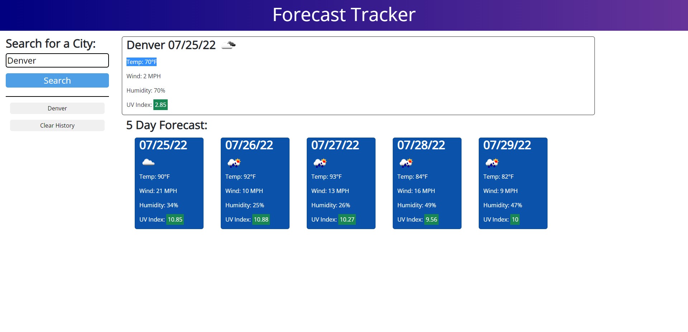
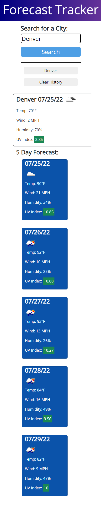
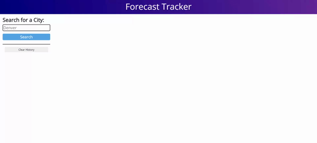

# Forecast Tracker

## Project Description

This project is a weather and forecast tracker that displays current weather data and a five day forecast. User search history is saved to easily display the weather again for a city the user has already looked up

## User Story

```
AS A traveler
I WANT to see the weather outlook for multiple cities
SO THAT I can plan a trip accordingly
```
## Usage

Use the search input to type in a city name then click search to find the weather for that city. Data will be displayed for the current weather as well as a five day forecast.
After searching for a city it is saved to the local storage so all you have to do it click the newly created button with that city name to see the weather for that city again.
Search for another city to see it's weather data and and have that search saved to local storage as well.

## Images

### Desktop 



### Mobile 



### Scheduler Demo 



## GitHub Links

### [GitHub Repo](https://github.com/PierTwo/forecast-tracker)

### [Deployed GitHub Pages](https://piertwo.github.io/forecast-tracker/)

## Made with Bootstrap, Google Fonts, JQuery, Moment.js, and API data from OpenWeatherMap
